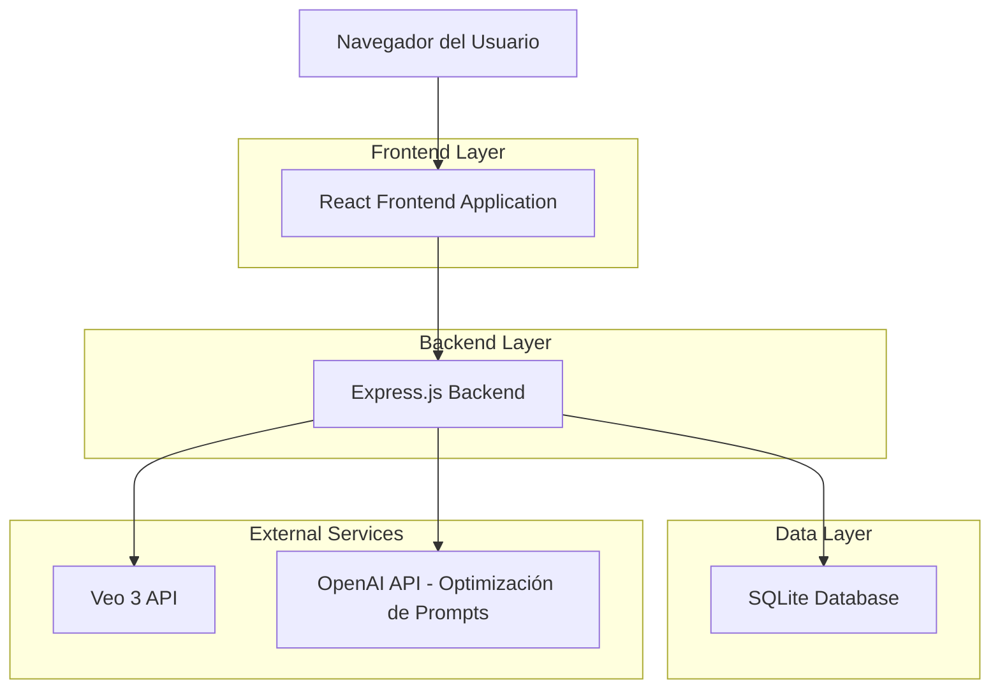
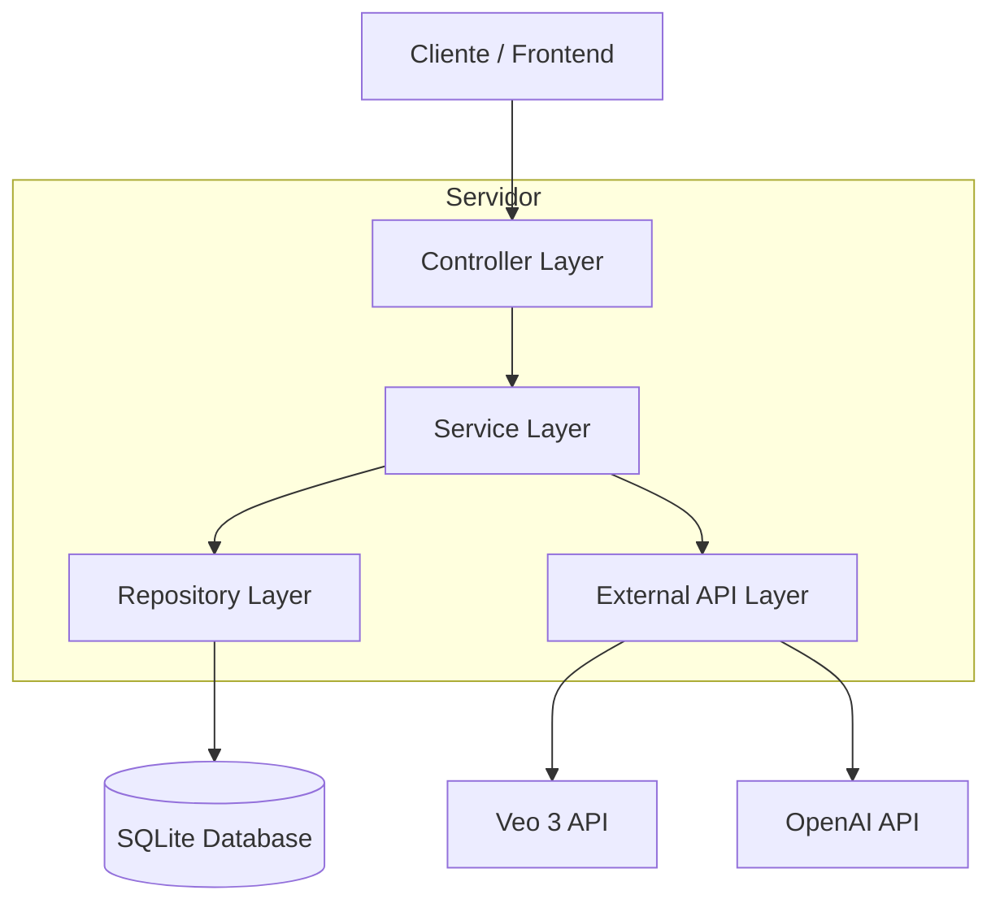
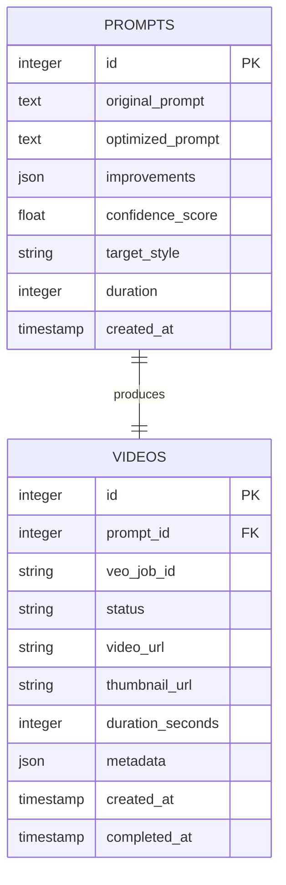

## 1. Diseño de Arquitectura



## 2. Descripción de Tecnologías

* **Frontend**: React@18 + TypeScript + Tailwind CSS + Vite + React Router

* **Backend**: Express.js@4 + TypeScript + Node.js@20

* **Base de Datos**: SQLite@3

* **APIs Externas**: Veo 3 API, OpenAI API (para optimización de prompts)

* **Almacenamiento**: Sistema de archivos local (para videos generados)

## 3. Definiciones de Rutas

| Ruta             | Propósito                                                |
| ---------------- | -------------------------------------------------------- |
| /                | Página principal con hero section y galería de ejemplos  |
| /editor          | Editor de prompts con optimizador automático             |
| /generator       | Interfaz de generación de videos con monitor de progreso |
| /player/:videoId | Reproductor de video individual con controles            |
| /gallery         | Biblioteca de todos los videos generados                 |

## 4. Definiciones de API

### 4.1 APIs Principales

**Optimización de Prompts**

```
POST /api/prompts/optimize
```

Request:

| Nombre del Parámetro | Tipo   | Requerido | Descripción                                         |
| -------------------- | ------ | --------- | --------------------------------------------------- |
| originalPrompt       | string | true      | Prompt original del usuario                         |
| targetStyle          | string | false     | Estilo deseado del video (cinematic, cartoon, etc.) |
| duration             | number | false     | Duración objetivo en segundos                       |

Response:

| Nombre del Parámetro | Tipo      | Descripción                                 |
| -------------------- | --------- | ------------------------------------------- |
| optimizedPrompt      | string    | Prompt mejorado para Veo 3                  |
| improvements         | string\[] | Lista de mejoras aplicadas                  |
| confidence           | number    | Nivel de confianza de la optimización (0-1) |

Ejemplo:

```json
{
  "originalPrompt": "Un gato jugando",
  "targetStyle": "cinematic",
  "duration": 10
}
```

**Generación de Videos**

```
POST /api/videos/generate
```

Request:

| Nombre del Parámetro | Tipo   | Requerido | Descripción                       |
| -------------------- | ------ | --------- | --------------------------------- |
| prompt               | string | true      | Prompt optimizado para generación |
| settings             | object | false     | Configuraciones adicionales       |

Response:

| Nombre del Parámetro | Tipo   | Descripción                        |
| -------------------- | ------ | ---------------------------------- |
| jobId                | string | ID único del trabajo de generación |
| status               | string | Estado inicial ("queued")          |
| estimatedTime        | number | Tiempo estimado en segundos        |

**Estado de Generación**

```
GET /api/videos/status/:jobId
```

Response:

| Nombre del Parámetro | Tipo   | Descripción                                           |
| -------------------- | ------ | ----------------------------------------------------- |
| status               | string | Estado actual (queued, processing, completed, failed) |
| progress             | number | Progreso de 0 a 100                                   |
| videoUrl             | string | URL del video (solo cuando status = "completed")      |
| error                | string | Mensaje de error (solo cuando status = "failed")      |

**Biblioteca de Videos**

```
GET /api/videos/library
```

Response:

| Nombre del Parámetro | Tipo   | Descripción                 |
| -------------------- | ------ | --------------------------- |
| videos               | array  | Lista de todos los videos   |
| totalCount           | number | Total de videos             |
| page                 | number | Página actual               |

## 5. Diagrama de Arquitectura del Servidor



## 6. Modelo de Datos

### 6.1 Definición del Modelo de Datos



### 6.2 Lenguaje de Definición de Datos

**Tabla de Prompts (prompts)**

```sql
-- Crear tabla
CREATE TABLE prompts (
    id INTEGER PRIMARY KEY AUTOINCREMENT,
    original_prompt TEXT NOT NULL,
    optimized_prompt TEXT NOT NULL,
    improvements TEXT, -- JSON como texto en SQLite
    confidence_score REAL CHECK (confidence_score >= 0 AND confidence_score <= 1),
    target_style VARCHAR(50),
    duration INTEGER,
    created_at DATETIME DEFAULT CURRENT_TIMESTAMP
);

-- Crear índices
CREATE INDEX idx_prompts_created_at ON prompts(created_at DESC);
CREATE INDEX idx_prompts_confidence ON prompts(confidence_score DESC);
```

**Tabla de Videos (videos)**

```sql
-- Crear tabla
CREATE TABLE videos (
    id INTEGER PRIMARY KEY AUTOINCREMENT,
    prompt_id INTEGER REFERENCES prompts(id),
    veo_job_id VARCHAR(255) UNIQUE,
    status VARCHAR(20) DEFAULT 'queued' CHECK (status IN ('queued', 'processing', 'completed', 'failed')),
    video_url TEXT,
    thumbnail_url TEXT,
    duration_seconds INTEGER,
    metadata TEXT, -- JSON como texto en SQLite
    created_at DATETIME DEFAULT CURRENT_TIMESTAMP,
    completed_at DATETIME
);

-- Crear índices
CREATE INDEX idx_videos_prompt_id ON videos(prompt_id);
CREATE INDEX idx_videos_status ON videos(status);
CREATE INDEX idx_videos_created_at ON videos(created_at DESC);
CREATE INDEX idx_videos_veo_job_id ON videos(veo_job_id);

-- Datos iniciales de ejemplo
INSERT INTO prompts (original_prompt, optimized_prompt, confidence_score, target_style, duration) VALUES 
('Un gato jugando', 'Un gato doméstico jugando con una pelota de lana en un jardín soleado, filmado en estilo cinematográfico con movimientos suaves de cámara', 0.85, 'cinematic', 10),
('Robot en el espacio', 'Un robot humanoide explorando la superficie de un planeta alienígena con dos lunas en el cielo, ambiente de ciencia ficción con iluminación dramática', 0.92, 'sci-fi', 15);
```

