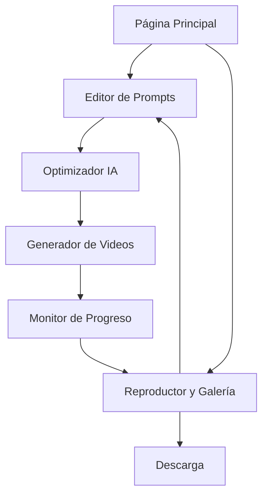

## 1. Descripción General del Producto

Sistema interno de creación de videos cortos que utiliza la API de Veo 3 para generar contenido audiovisual de alta calidad a partir de prompts de texto optimizados automáticamente.

Herramienta interna que permite generar videos profesionales sin conocimientos técnicos, optimizando automáticamente las ideas para maximizar la calidad del resultado final.

Objetivo: Facilitar la creación de contenido audiovisual mediante IA para uso interno del equipo.

## 2. Funcionalidades Principales

### 2.1 Acceso al Sistema

Sistema de acceso directo sin autenticación para uso interno. Todas las funcionalidades están disponibles para cualquier usuario que acceda a la aplicación.

### 2.2 Módulos de Funcionalidad

Nuestro sistema de creación de videos consta de las siguientes páginas principales:

1. **Página Principal**: hero section con demo, navegación principal, galería de videos de ejemplo.
2. **Editor de Prompts**: interfaz de entrada de texto, optimizador automático, vista previa de prompt mejorado.
3. **Generador de Videos**: integración con Veo 3 API, monitor de progreso, configuración de parámetros.
4. **Reproductor y Galería**: reproductor integrado, biblioteca de todos los videos generados, opciones de descarga.

### 2.3 Detalles de Páginas

| Nombre de Página | Nombre del Módulo | Descripción de Funcionalidad |
|------------------|-------------------|------------------------------|
| Página Principal | Hero Section | Mostrar demo interactivo del sistema, casos de uso principales |
| Página Principal | Galería de Ejemplos | Exhibir videos generados destacados con sus prompts originales |
| Editor de Prompts | Entrada de Texto | Capturar prompt inicial del usuario con validación en tiempo real |
| Editor de Prompts | Optimizador IA | Analizar y mejorar automáticamente el prompt usando técnicas de NLP |
| Editor de Prompts | Vista Previa | Mostrar comparación entre prompt original y optimizado |
| Generador de Videos | Integración Veo 3 | Enviar prompts optimizados a la API y gestionar respuestas |
| Generador de Videos | Monitor de Progreso | Mostrar estado de generación en tiempo real con estimación de tiempo |
| Generador de Videos | Configuración | Permitir ajustes de duración, estilo y calidad del video |
| Reproductor y Galería | Reproductor HTML5 | Reproducir videos generados con controles completos |
| Reproductor y Galería | Biblioteca General | Organizar y gestionar todos los videos generados con etiquetas |
| Reproductor y Galería | Exportación | Descargar videos en múltiples formatos y resoluciones |

## 3. Proceso Principal

**Flujo Principal:**
1. El usuario accede a la página principal y explora ejemplos
2. Navega al editor de prompts e ingresa su idea inicial
3. El sistema optimiza automáticamente el prompt mostrando mejoras
4. El usuario confirma y envía el prompt optimizado al generador
5. El sistema procesa la solicitud a través de Veo 3 API
6. Una vez completado, el video se muestra en el reproductor integrado
7. El usuario puede descargar el video o ver todos los videos en la galería

## 4. Diseño de Interfaz de Usuario

### 4.1 Estilo de Diseño

- **Colores Primarios**: #6366f1 (índigo), #8b5cf6 (violeta)
- **Colores Secundarios**: #f8fafc (gris claro), #1e293b (gris oscuro)
- **Estilo de Botones**: Redondeados con gradientes suaves y efectos hover
- **Tipografía**: Inter para textos principales, tamaños 14px-24px
- **Estilo de Layout**: Diseño de tarjetas con espaciado generoso, navegación lateral
- **Iconos**: Lucide React con estilo minimalista, animaciones sutiles

### 4.2 Resumen de Diseño de Páginas

| Nombre de Página | Nombre del Módulo | Elementos de UI |
|------------------|-------------------|----------------|
| Página Principal | Hero Section | Gradiente de fondo índigo-violeta, video demo autoplay, CTA prominente |
| Página Principal | Galería de Ejemplos | Grid responsivo 3x2, cards con hover effects, overlay con prompt |
| Editor de Prompts | Entrada de Texto | Textarea expandible, contador de caracteres, sugerencias contextuales |
| Editor de Prompts | Optimizador IA | Comparación lado a lado, highlighting de mejoras, botón de aplicar |
| Generador de Videos | Monitor de Progreso | Barra de progreso animada, estimación de tiempo, logs en tiempo real |
| Reproductor y Galería | Reproductor HTML5 | Controles personalizados, pantalla completa, velocidad variable |

### 4.3 Responsividad

Diseño mobile-first con adaptación completa para desktop. Optimización táctil para dispositivos móviles con gestos intuitivos para navegación y reproducción de videos.